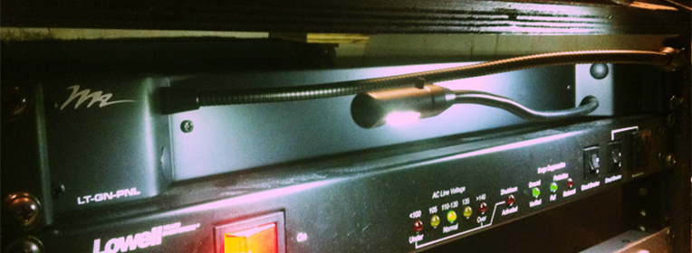

So I've been looking for some good desk lamps to put in our tech booths. We've tried the cheap Target lamps which lasted for a few years, but I had some qualms. They got hot (being quartz lamps), they got knocked off the desks often, and the lamps would continually burn out. After that, I found some old LittleLites laying in our closet that we're missing lamps. They're probably ten years old. I likes these because they were dim-able and rack-mounted so they would fall off the desks. However, they frequently burned people and the lamps are super delicate. After a short run and replacing lots of lamps (we're talking weekly, folks), I decided enough is enough.

I wanted cheap LED desk lamps. My reasoning was I wanted lights that didn't burn out as easily, that if I left on during the week wouldn't cost a lot, didn't burn kids, and didn't cost an arm and a leg. The search began.

Did you know that LED desk lamps are pretty expensive? I mean, there are a few cheap ones with pencil and iPod holders that are $20-30, but for one that will last more than a few weeks in our youth room we're talking $50-60 a pop. And I was looking to buy one per position in each of our tech rooms (probably 10 total)! This was totally not doable. That's when I stumbles upon this:

[Middle Atlantic Dual Gooseneck LED Single Rackmount][1]

There are a few major wins to this light.

1. LED. Low power consumption. They won't scar anymore children (or me!).
1. They are bright! It only takes one of the two to light a workstation.
1. They're DUAL! Because we have two people per desk in our room, I can rack this light in-between them and cut cost in half!
1. They're rack-mountable. No more falling off the desk and breaking lamps.
1. It's durable. We're talking Middle Atlantic, the company who makes road-ready, metal equipment. This is going to outlast any Target light.
1. Only \$50! That's as much or less than I would have paid for one "cheap" LED desk lamp.

So I bought a few. They are awesome. I'm going to be testing them out for a while and I'll update this post if any of them fail, but I'm not expecting that to happen for a few years.

[1]: http://www.middleatlantic.com/power/lt1r.htm
