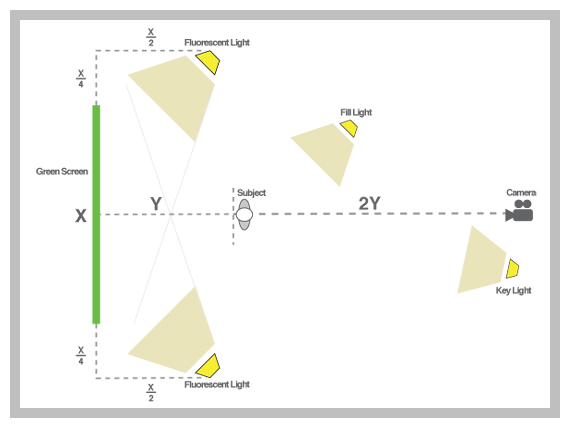
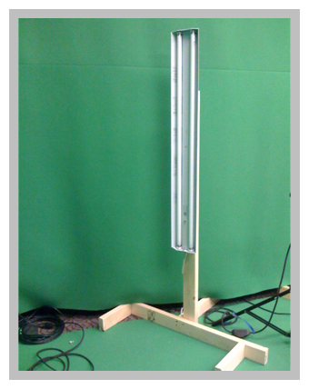

I've had a ton of people ask how to shoot on a green screen. There are literally an infinite ways to do it "correctly", but here is my process, with ideas that I picked up through film school and trial-and-error. It is by no means "perfect" but I feel that it is worthy, being that we use it all the time. Use some or all, and let me see some footage when you're done!

The first thing to note is that when you are lighting a green screen scene you are actually lighting 2 scenes independently: the screen and the subject. Ideally the lighting in one set-up will not interfere with the lighting in the other. One common mistake is to set-up and shoot in front of a green screen without knowing what you are going to place your subject in front of in post. In order to make the subject "feel" like they are a part of the shot, they need to be lit similarly to the background plate. So, before I start lighting my green screen, I find or shoot the footage for the background plate. I then analyze the light sources (color, position, angle, intensity, etc.) to know where the sources will need to be in the studio.

## Lighting Scene #1 - The Screen

Start by setting up the screen. Try and make this as wrinkle-free as possible. Lighting the green screen is difficult because every blemish, every difference in color value, will not key. You can usually stretch the fabric in different ways to clean out creases and folds a little. Also, having any AC vents or fans in the proximity turned off will definitely help. Let's get some basic math out of the way to help us find general placement of major objects. Refer to the image below to help out with this. If your green screen is X wide, then you will want your green screen lights X/4 out from the endpoints and X/2 in front, pointing towards the screen. These lights will only be used for the green screen itself. Next, your subject will need to remain outside of this lighting, which means they will need to be at least X/2 away from the green screen, but I usually add a few feet for good measure. Let's call this distance (X/2 + a few feet) Y. Place your camera 2Y away from your subject. This will give you a good depth of field in-between your subject and green screen, which will hide some of the blemishes.

Next, to light the green screen, I use some Cheap-o Kino-Flos that I fashioned a while ago.

The idea is that you want broad, even lighting, so any wash light will work. However, turns out that standard fluorescent lights have a slight green spike to their color temperature (which is why office buildings and hospitals are so nauseating), so we can use this to our advantage, making the green screen, well, greener. [Kino Flo][1] makes the lights that Hollywood uses, but, as you would imagine, they're a little out of a church budget [Here are the basic plans to the lights I made][2], but feel free to modify them. I think with the cheapest shop light at Home Depot I spent a total of $25 a light, including the stands. There are a few schools of thought in order to evenly light a green screen. One is to hook up a [Vectorscope][3] that has a waveform monitor and try and get a thin, straight line by moving lights around and forward/backwards. This may not be an option if you don't have a vectorscope lying around (honestly, who does?). The new Adobe On Location has a vectorscope and waveform built in that you can use by plugging into your computer's firewire port. This also may be too costly. My friend Pete told me of one other solution. Most prosumer cameras have zebra levels, which are an annoying marquee effect that applies itself to your viewfinder on 'hot' areas (areas of usually over 85% brightness). You can enable zebra and change the iris on the camera to see where trouble areas in brightness may be, adjust your lights and check again. Although tedious, if your screen isn't lit properly, you may wind up with a whole lot of footage of a person in front of a piece of green fabric that you cannot use.

## Lighting Scene #2 - The Subject

Once you have the screen lit evenly, it is time to light your subject. Here is where you will try to light your subject according to the background plate that you have hopefully acquired. Generally this starts with a basic 3-point lighting system. A 3-point system, as the name suggests, includes three lights: a Key Light, a Fill Light, and a Back Light.

## 3-Point Lighting

The Key Light is called such because it is the "key" to the look. It is the light that mimics the major source in your scene. If there is a sun lighting your plate, make your key light light your subject from that angle, with similar intensity and color as the plate. I will usually use a 650w Arri with a softbox for my Key Light and it is generally placed just off of the camera-plane. 

Generally a key light winds up a little off to one side of a subjects face, leaving a huge shadows crawling across from the nose and eye sockets. This is where the Fill Light comes in. The fill light "fills" in the subject so that you can get definition in the subject. Depending on how dramatic you want the shot, you can dim this light to create lots or little shadow. For this light I usually use my other 650w Arri with a softbox, pushed back farther in the set to make the light a little dimmer than the Key. The last light, the Back Light, is used for giving a hairline glow around the subject to add dimension. A lot of times a subjects shadow around the shoulder or darker hair can get lost in a dark background plate, making them see two-dimensional. A soft backlight can help this. Use a smaller light (I use a 125w Arri), placed behind the green screen and off to the side. It is important to watch out for lens flares here, since you are effectively pointing a light into the lens of the camera. You can either keep moving the light off axis to make sure the flare falls out of the shot, or you can use a "flag" (any solid object) that stands just out of frame to block the light. Another thing to try is to place a magenta gel in your back light. This helps by creating a magenta ring around the subject, especially the hair. This is useful because Magenta is opposite to chroma Green in the color wheel (remember grade school?). 

Because it is opposite, your keyer will avoid anything with that color hue, i.e. the fly-away hairs in your shot. You'll have to make sure that it doesn't completely turn your subject pink though... and that it looks natural. Subtleness is usually key (pun?).
That should be about it for lighting your subject. Make sure it matches your background plate and that your subject stays in front of your green screen's wash lights. 

[1]: http://www.kinoflo.com/
[2]: http://churchtechtalk.com/downloads/graphics/CheapoKinoFlo.pdf
[3]: http://en.wikipedia.org/wiki/Vectorscope

