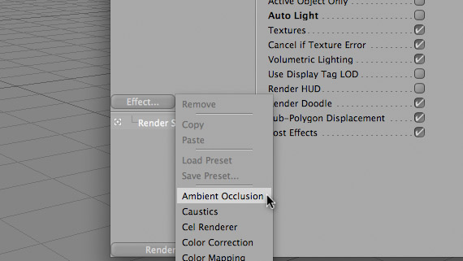
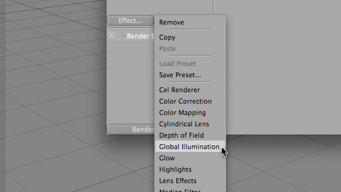

I don’t care who you are or how amazing of a 3D modeler you are, but if your render settings suck, then your work will show it. It’s kind of like using cheap paints and construction paper to create fine art: You can probably do it, but the end result may not be as pleasing to the eye.

When in C4d, there are some “Magic Check-Boxes” that will automatically make everything you create look better (and, of course, raise your render times!). I’m no physicist, but I am going to try and also give my laymen’s terms as to what these boxes are doing. If I’m wrong with any of this stuff, please feel free to correct me (gently, please). Also, I think it is important to point out that most of these settings, if not all, are only available with the C4D Advanced Render Module.

First, Maxon was nice enough to place an invisible light in a blank scene, that way, if you’re modeling and you need to see what it looks like rendered, you can render it without fussing over adding lights. This feature is called Auto Light. Because we have already inserted our amazing light set-up into our scene, we don’t need this light.

Goto Render Alt+Render Settings (or CMD+B on a Mac).

Select Options from the side list of setting groups. In this panel, uncheck “Auto Light”.

Alright, now imagine a hypothetical room with 1 light shining on a red ball. You could say that since a light in shining on a red ball, the light will illuminate 1/2 of the red ball fully, and the other half will be dark. However, light attenuates, or diminishes, as it wraps around the ball. One algorithm that tries to solve this is called “Ambient Occlusion”. Another example of this is how a small flashlight will not only light up the area it is shining on, but very-slightly illuminate the entire room. We want that. So:

Click the “Effect…” button on the left of the sidebar, and choose “Ambient Occlusion”. (Because I don’t really know what I am doing, I leave all these settings on default).

Now, sometimes in real life, light tends to bounce tangent to objects. Because of this, sometimes light rays can bunch up, thus creating a optical “hotspots”. Examples of this would include the crazy patterns of light on the bottom of a pool, or the light projected through a glass marble, or the concentrated light following an ant from a menacing magnifying glass. This effect isn’t only with transparent-curved objects, but those are the easiest examples to see. This phenomenon is called “Caustics”. (an interesting side-note: the word caustics actually comes from the Greek word αυστός, meaning burnt, or Latin causticus, meaning burning. (Thank you Wiki!))

To turn on Caustics, click on the “Effect…” button on the left of the sidebar, and choose “Caustics”. (Again, I leave it all on default.)

Sweet. Now, let’s make the scene a little more realistic. When you have light in 3D space shining in a room full of objects, most renders will show you exactly that. However, in real life, when light shines on objects, what we see is a reflected spectrum of light. Also, in real life, that light now has the ability to continue on other trajectories (other than your eye) and reflect off of other objects in the room. Because light is bouncing off of a red ball onto a white floor, then to our eye, directly under the ball will have a shade of red to it. This is called “Global Illumination”.

Click on the “Effect…” button on the left of the sidebar, and choose “Global Illumination”. (You guessed it, default.)

Global Illumination, or GI, takes a few passes at a frame, in order to find the trajectory of “photons”. This will SIGNIFICANTLY raise you render times, so for me, I uncheck GI until I’m ready for my final render.

Thats it! Good Luck and be sure to comment a link to some of your renderings, or thoughts on this tutorial!
