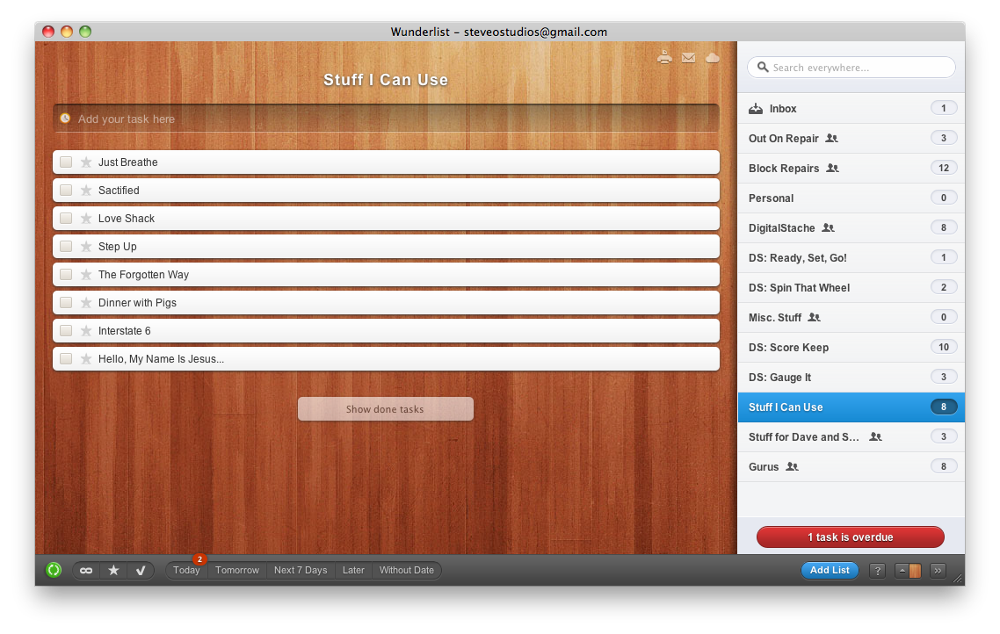

I discovered this gem in the "Recently Added" section of the iPhone App store last December. I didn't think much of it because my team and I were trying out [Things][1], a very popular and very pretty todo manager. What we were (still are) looking for is an easy, pretty todo manager, but we wanted device syncing and sharing, all for a low, low price. Things has been promising these things for a while, and while I'm sure that they will be awesome whenever they do come out, we want something now. Thus, late one night, I gave Wunderlist a whirl.

[Wunderlist][2] is easy. It doesn't have very many options at all. But that is where it may be a little deceiving. Wunderlist automatically cloud syncs after every change, which means that instantaneous access from multiple devices is there. And speaking of devices, the 6wunderkinder team from Berlin has made iPhone/iPod, iPad, Mac, Windows, and Android versions of their popular Wunderlist app, as well as a web version that can be access from anything else. It also shares between other Wunderlist users, so my team and I can have lists that we tackle together. And all of this for the low price of absolutely free! You can't really beat that!

While there are a few features that we would still like to see (delegation, repeating tasks, more robust note system), they are updating the app often, and some may be included eventually, however they are currently working on their flagship application called "Wunderkit". Wunderkit will be a paid application (most likely subscription-based), but has been rumored to be more along the lines of team/project management and collaboration. Wunderlist is just there to whet your whistle.

You can download [Wunderlist][2] here.

[1]: https://culturedcode.com/things/
[2]: https://www.wunderlist.com/
