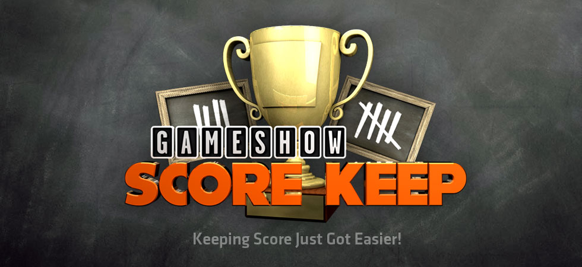
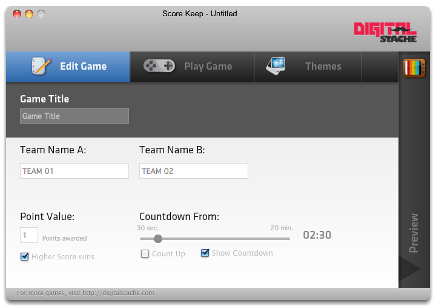
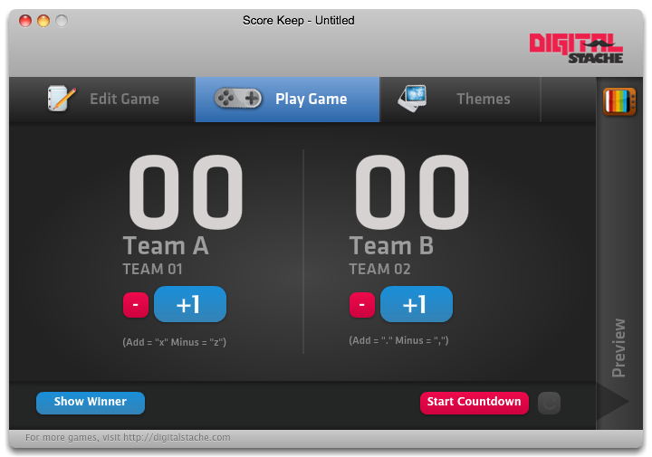
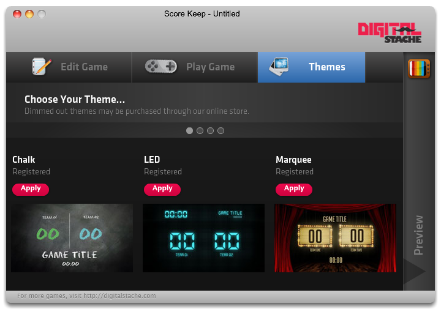

We like to have a lot of fun in our youth ministry, and that usually means games. Throwing footballs through toilet seat covers, 300 student volleyball games, you know. But there has never been a good way to keep score, until now!

Like Spin That Wheel, Score Keep is made to be played on a single computer, PC or Mac, with the second display going out to a projector or TV on stage for large group interaction. You can customize the game by naming the game whatever you want, as well as your team names. If you want a count-down (or count-up) you can enable one and set the time. The Point Value is where you can set how many points are given at a time. You can even set whether a low score or high score wins (Auditorium Golf anyone?).

In the Play tab you can keep score with rapid fire clicks, or use the shortcut keys to add or minus points. You have basic countdown controls and when the game is officially over, have the game announce the winner!

Finally, and this is in my mind the most exciting part, there are themes to make your game unique every time you play. Included are 10 themes to choose from (5 of which are Premium that can be unlocked after purchased from the website).

You can save your Score Keep files for later use (make a game on Wednesday for Sunday’s use) or to share your game for other ministries to use on our Community Exchange page.

Score Keep is available for \$25.
