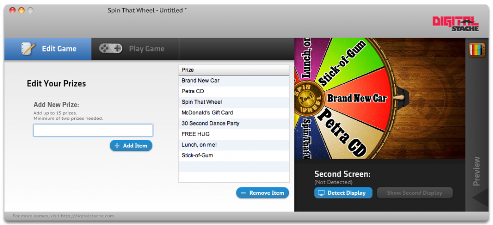
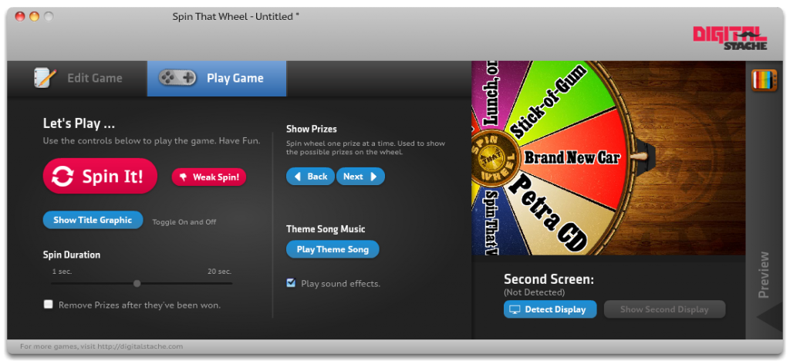

I'll have to be honest and say that I'm a little biased about this week's pick, Spin That Wheel, because my buddy Dave and I developed it. That being said, it's still really fun to use, super simple, and DANG is it pretty!

A little over a year ago, Dave and I were looking at games that we could play in our youth ministry, but the pickin's were slim. That is when we decided to see if we could make some of our own!

To start with, we created Spin That Wheel, which, like it sounds, is a wheel that goes on your TV or projector that a contestant yells "Spin That Wheel!", and an operator clicks a button that spins it. However, it is totally customizable! It automatically scales, so it is HD or SD, or Any-Other-D. It works on PC or Mac. Check it out.

In the edit screen, you can enter up to 15 prizes. You can rearrange them, delete, etc...It's pretty tight.

In the Play Mode, there is a lot of control over how the game is played. First, you have the giant "Spin It!" button. But you can also, if the contestant is too-cool-for-school, hit the "Weak Spin!" button, which will barely spin the wheel, forcing the contestant to yell louder. You know, put a little more umph into it! You can change the Spin Duration at the bottom, to fit your momentum.

There is also a title graphic that you can put up while you're moving on to your next contestant. There is a fun theme song that you can also play. And when you're familiarizing your contestants and audience with the prizes, you can scroll through with the next and back buttons.

You can download a free trial of Spin That Wheel from our website. Registration removes the watermark, and costs \$25.
