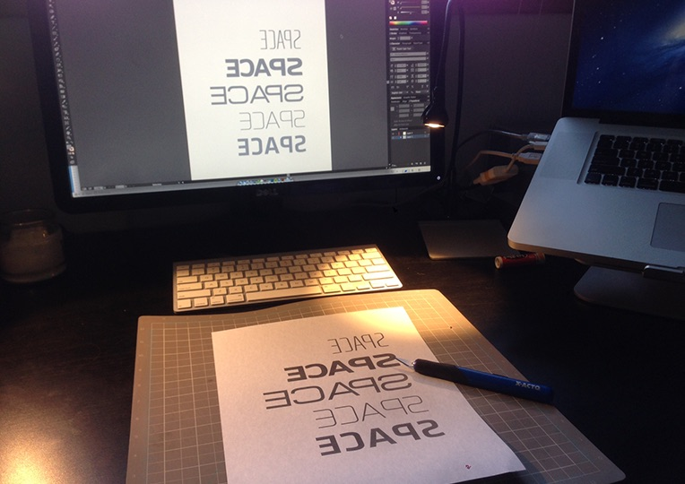
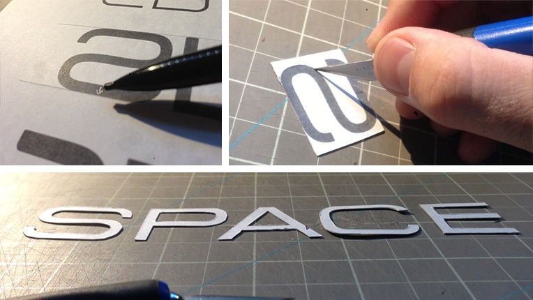
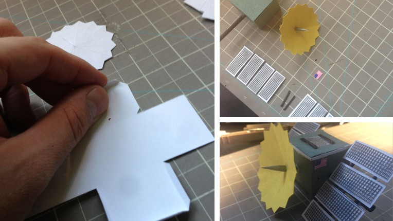
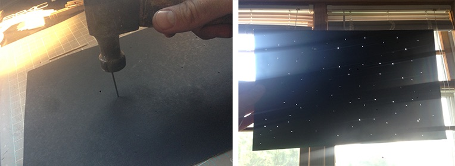
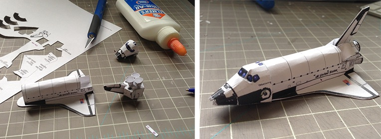
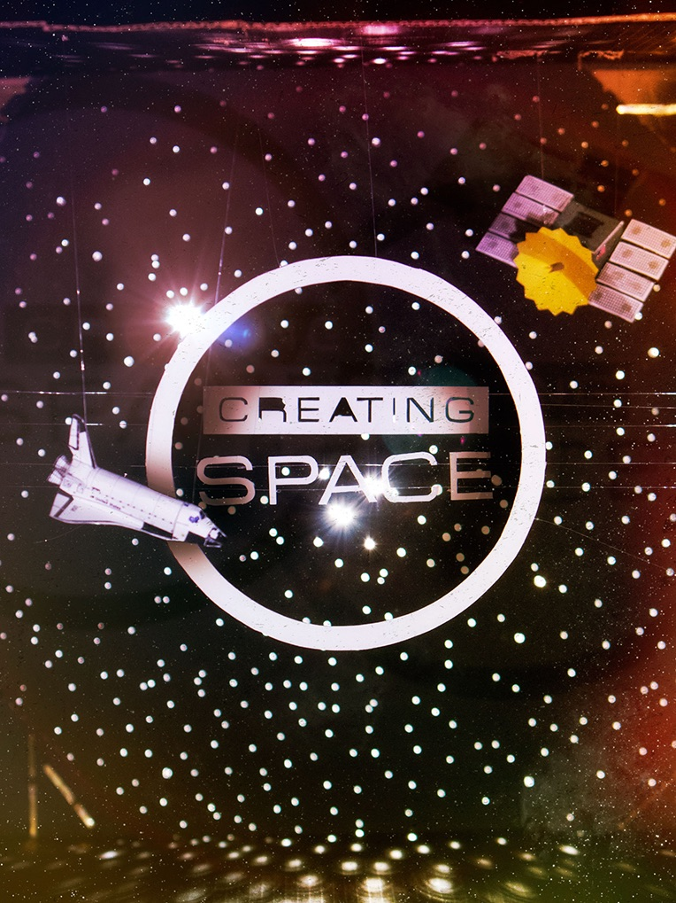

I think that [Jonathan Malm][1] from [Sunday Magazine][2] (among other fames) and I have a good working relationship; He gives me challenging graphics with little direction, complete creative freedom, and tons of grace when I hand it off three days late (It's happened more than it should, and I think he plans for it now).

The title of the article (and magazine) for [this month's Sunday Magazine][3] is "Creating Space". There are a million directions one could go - workspaces (desks, cubicles, coffeeshops), production spaces (stages, backstage, FOH, rack spaces, stage sets), time (clocks, timelines) - all of which we could go with for the piece. But then, in Jon's email, this:

> The visual theme for the issue is…bum bum bum…space! :)

Got it! Space! The final frontier! Beam me up! I'm a huge sci-fi buff, and I could do space graphics all day long. But, I and other readers of the magazine, can't create space, at least not in the literal sense. That is what God does. And there is no way I could do what He does. So I knew that I wanted something that was almost a spiritual journey for myself, meditating on how He created SPACE, and how I can only make a little mock-up.
To communicate the "create" part of the title, I wanted to physically, with my hands, "create space".

The first thing I did, was find a box. I wanted something big and, well, spacious. I cut off the flaps and painted the inside flat black. You know, space.

Using the physical size of the opening as a measurement, I opened up Adobe Illustrator and typed out the word "Space" in several different fonts that looked spacey. Then I changed the color to a medium grey and reversed them, and printed out the sheet on card stock.

Why medium grey and backwards text? Great question. The medium grey is for two reasons: With the laser printer I have, if something is printed in pure black, the toner smears. I knew I wanted white paper in the end, so less toner on my hands was important. I also didn't want the black to show through the paper if I shined a light through it. I want a white glow. The Backwards text is because I am going to physically cut out the letters, I want them to be white, so if I cut with the white side down, flip when I'm done, I will have really clean lines and no eraser marks! Why card-stock? Because I need a paper that can withstand what I am about to do to it. It needs to have strength! I also marked the tops of the letters at the start. It would suck if I got done cutting the letters out, making the diorama, take the picture, only to realize that there is a subtle difference in the orientation of the letter 's'. Better to be safe than sorry. Then, I cut out the letters. I did the same, reversed with the word "Creating".

For the Satellite, I google imaged satellites to get some inspiration. I designed a simple box in Illustrator, a crazy star-cone, and drew the eight solar panels. I printed them on grey and yellow construction paper and white cardstock and cut accordingly. For the construction I also used toothpicks, skewers (both Sharpie-d black), a small amount of tin foil (the square on top) and screen material (don't really know why I have that lying around :) ).

I had some rolled balls of tin foil, spray painted grey as well to act as astroids, but they turned out a little cheesy, so they got cut!

The star field was a sheet of black poster-board that I stabbed with a few different sized nails. I guess I have a lot of pent up aggression, huh!

Finally, I found a paper-craft model of a space shuttle online. I scaled it down with my printer, cut it out and built it.

Assembly was probably the most difficult. I ran fishing line across the box at varying depths, creating "invisible" clotheslines for the letters, word and circle to sit on. I made the ends of the fishing line held tight by the cut in the box, that way I could always pull the slack out or shift the lines, just in case. The shuttle and satellite were hung similarly, but hanging from the top, Christmas ornament style.

I set it up in my basement (which I'm remodeling, so pardon the mess), where I could control the light and noise since my wife and son were asleep! The front light was two IKEA LED desk lamps, while the backlight was a 300w video light (Mole Richardson Inbetweenie).

Then I photographed it!
One of the hardest things I'd found in this project was trying to create something fun that communicates space, but still show that it is all "real". For instance, how black do you make the blacks of space?

Also, in real life you can move about the diorama, 'feeling' the 3D space. With a still, it looks like it's all on one plane! So I had to use light and a little Photoshop to enhance the depth.

In Photoshop my goal was to make it feel a little less like pile of trash and more like a fantastic universe, yet maintain the craftiness. Here is the before and after.

There you have it. It was a ton of fun and cool to pray through. I think God did a better job, though, honestly! :)

[1]: http://www.jonathanmalm.com/
[2]: https://www.sundaymag.tv/
[3]: https://sundaymag.tv/18/
