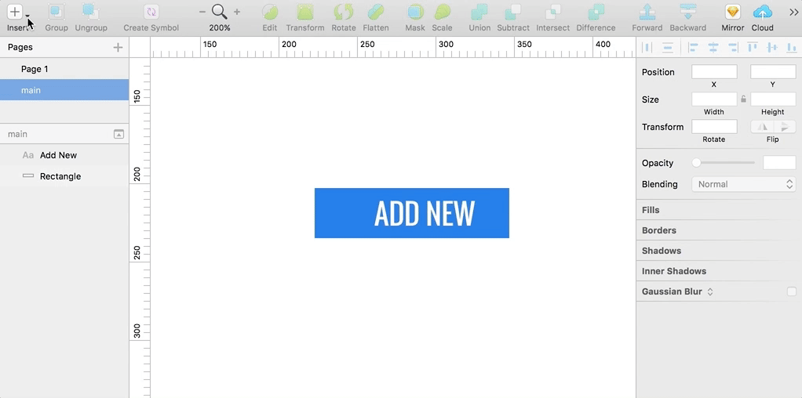
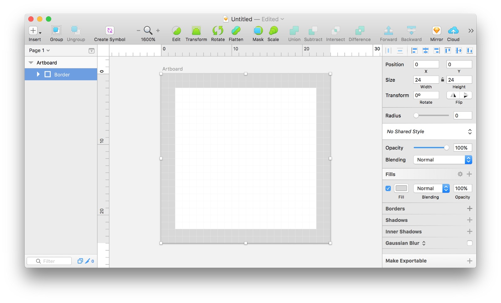
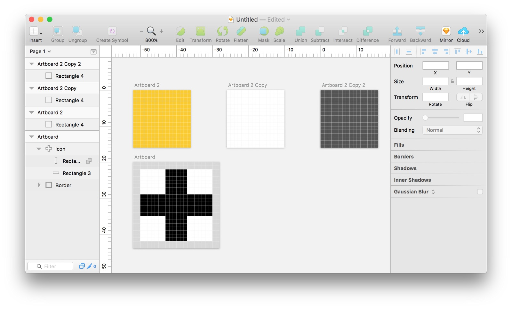
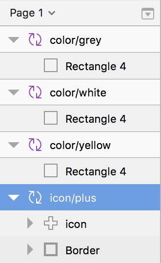
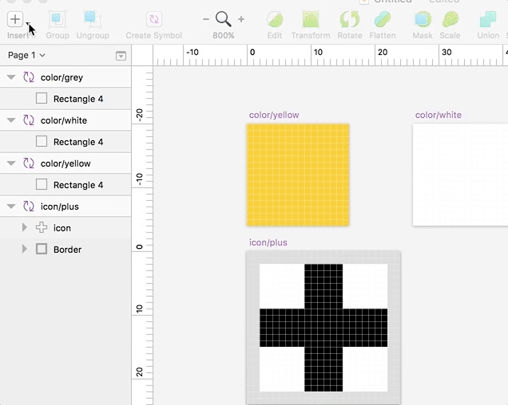
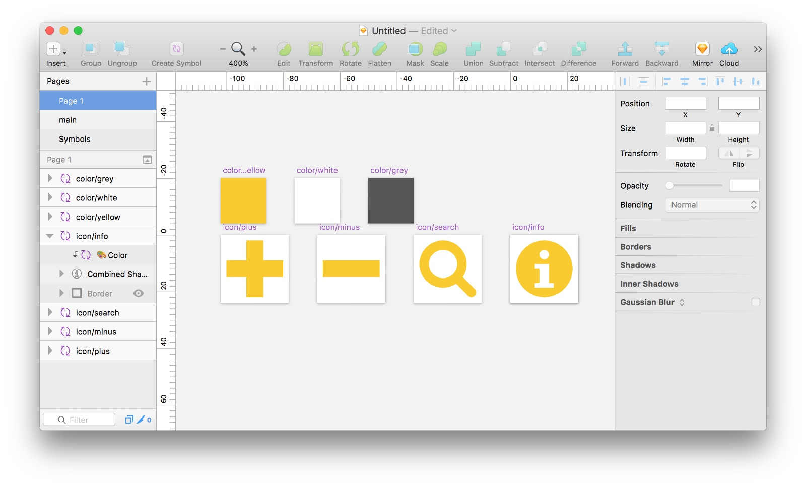
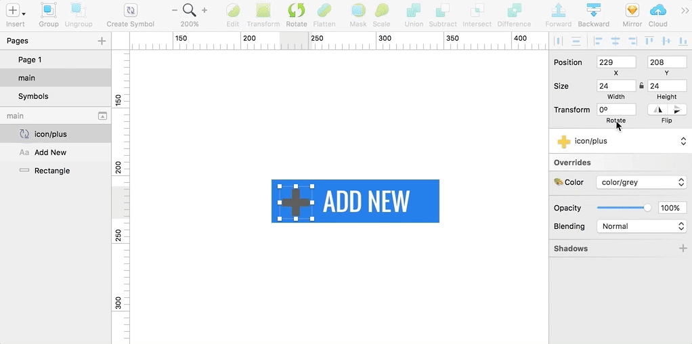

With Sketch’s powerful Symbols and Overrides you can quickly and easily create an icon set that uses an override to change the color!

---

First, let’s set up our icon’s artboard. What I have here is a 24px by 24px artboard with a inner 2px trim. I like to set up a border that can I reuse for all of my icons. This layer will be hidden when it comes time for placing the symbol.

Next, let’s create a simple icon that I’ll be reusing throughout my project — a standard plus sign.

Once the icon is created, make sure that it is flattened into paths as much as it can be. You can use Layer > Paths > Flatten or Sketch’s built in Boolean Operations. The goal is that you have one clean, flat icon. I’ve also set the fill to black just for contrast.

Next, let’s three more artboards that are each 20px x 20px. In each of these put a rectangle filling the entire artboard. Set the fill to colors you may want the icons to be.

In Sketch, size matters. Sketch uses the physical pixel size to determine a symbol’s relationship to other symbols. It will automatically assume that similar size symbols belong together. We’ll use this to help us choose different colors for our icons. In the case of our exercise, make sure that any “color” symbols are 20px x 20px, and the “icon” is 24px x 24px.

Next, convert all of these to Symbols by selecting the artboard and clicking “Create Symbol”. Then rename the symbols to make a little more sense.

Another neat trick Sketch has up it’s sleeve has to do with layer names. Layer names can be used for organization. When you prefix layer names with the same thing and a / then they will be grouped together in the Symbols menu. This will become super useful if you have tons of symbols!

Here is what my layer list looks like now:

Next, drop one of the colors on top of the icon.

Then, go to Insert > Symbol > color > yellow and drop that right into your icon/plus on top of all the other layers.

Scale the color layer to fill the full icon artboard.

Then select the icon layer and press the mask button.

(Whoops! Make sure you hide the border layer when you’re done!)

Now I like to label the “color/yellow” layer in my icon to something more meaningful — like 🎨 Color. This will make it easier to find when you need to change the color. 😉

Now in any part of your Sketch document you can insert the icon symbol. just like any other symbol. However, over on the right you can change the color to one of your pre-made colors!

What’s super cool about this is you can duplicate your icon symbol and create as many icons as you’d like.

And then change the icon from your symbol settings.

Whew! Now it’s time to party!

