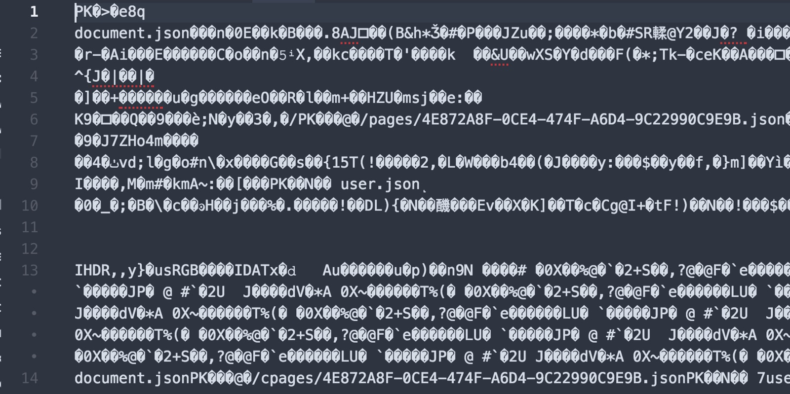
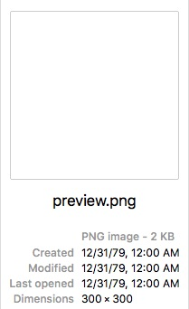
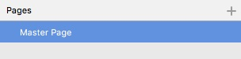

Recently Sketch 43 introduced a new “open” file format in. I’m super fascinated by the idea of an open file format. I wanted to know more about what _exactly_ that means, because it could open up a world of possibility, one which is currently _closed_ (pun intended) by Sketch’s competitors.

So I set out to find out more. Here are my findings.

I started by creating a folder with nothing in it. I then created a new Sketch document in that folder. I didn’t do anything to it (not even scroll or zoom inside).

Now, generally with “open” file formats you can just drag-n-drop the file into a text editor and, boop-boop-beep, you can read the contents. However, when I tried to open my new Sketch file in my text editor, I got this:



Hmmm. Okay, so not totally human readable. There are a couple of bits in here that are readable though… specifically the phrases `user.json` and `document.json`. A JSON file is type of file that is basically an organized list of data. These must refer to JSON files somewhere on my computer. This looks compelling, but I have no idea where those files are. Which got me thinking. Maybe the file is zipped?

So, I tried right-clicking on the file to unzip. No luck. So I fired up Terminal an tried this (I did this in the directory of my Sketch file, which is called `git_demo.sketch`):

```shell
$ unzip git_demo.sketch
Archive: git_demo.sketch
inflating: document.json
 inflating: pages/4E872A8F-0CE4-474F-A6D4-9C22990C9E9B.json
 inflating: user.json
 inflating: meta.json
 inflating: previews/preview.png
```

Whoa! There we go. I see it even found a `user.json` and `document.json`. that were alluded to earlier. That’s cool!

Now, let’s take a look at what these files probably are (I say _probably_ because it’s all conjecture. I have no idea what Sketch does behind the scenes):

## document.json

```json
{
  "_class": "document",
  "do_objectID": "45DEEB9C-77D3-42C1-8466-A3A26388931A",
  "assets": {
    "_class": "assetCollection",
    "colors": [],
    "gradients": [],
    "imageCollection": {
      "_class": "imageCollection",
      "images": {}
    },
    "images": []
  },
  "currentPageIndex": 0,
  "enableLayerInteraction": true,
  "enableSliceInteraction": true,
  "foreignSymbols": [],
  "layerStyles": {
    "_class": "sharedStyleContainer",
    "objects": []
  },
  "layerSymbols": {
    "_class": "symbolContainer",
    "objects": []
  },
  "layerTextStyles": {
    "_class": "sharedTextStyleContainer",
    "objects": []
  },
  "pages": [
    {
      "_class": "MSJSONFileReference",
      "_ref_class": "MSImmutablePage",
      "_ref": "pages/4E872A8F-0CE4-474F-A6D4-9C22990C9E9B"
    }
  ]
}
```

In here you can find things like `colors`, `gradients`, `symbols`, `images`, and `layers`. It looks like this is global settings are stored. I also see in here is a list of `pages` and `artboards`. I can see a reference to `pages/4E872A8F-0CE4–474F-A6D4–9C22990C9E9B.json` so let’s take a look at that next.

## pages/4E872A8F-0CE4–474F-A6D4–9C22990C9E9B.json

```json
{
  "_class": "page",
  "do_objectID": "4E872A8F-0CE4-474F-A6D4-9C22990C9E9B",
  "exportOptions": {
    "_class": "exportOptions",
    "exportFormats": [],
    "includedLayerIds": [],
    "layerOptions": 0,
    "shouldTrim": false
  },
  "frame": {
    "_class": "rect",
    "constrainProportions": false,
    "height": 300,
    "width": 300,
    "x": 0,
    "y": 0
  },
  "isFlippedHorizontal": false,
  "isFlippedVertical": false,
  "isLocked": false,
  "isVisible": true,
  "layerListExpandedType": 0,
  "name": "Page 1",
  "nameIsFixed": false,
  "resizingType": 0,
  "rotation": 0,
  "shouldBreakMaskChain": false,
  "style": {
    "_class": "style",
    "endDecorationType": 0,
    "miterLimit": 10,
    "startDecorationType": 0
  },
  "hasClickThrough": true,
  "layers": [],
  "horizontalRulerData": {
    "_class": "rulerData",
    "base": 0,
    "guides": []
  },
  "includeInCloudUpload": true,
  "verticalRulerData": {
    "_class": "rulerData",
    "base": 0,
    "guides": []
  }
}
```

This looks like all of the data associated with my page (I only have one, since it’s a brand-spanking new file). I can see rulers, the page name, page size and a few other cool things in here. Note there are no `layers`. Also worth mentioning is the _name_ of this file. `4E872A8...` is probably a randomly generated number, so you could in theory have tons of pages and none of them conflict with each other.

## user.json

```json
{
  "B79428F3-B5ED-4FB8-A32F-4A3731702ADA": {
    "pageListHeight": -1
  },
  "4E872A8F-0CE4-474F-A6D4-9C22990C9E9B": {
    "scrollOrigin": "{0, 0}",
    "zoomValue": 1
  }
}
```

This looks like it’s mostly stuff relating to _you_ and your Sketch file. Stuff like your `zoom` and `scroll`. When you open up your Sketch project the next time, you want it to be just how you left it. Here is where that stuff gets stored.

## meta.json

```json{
"commit": "335a30073fcb2dc64a0abd6148ae147d694c887d",
"appVersion": "43.1",
"build": 39012,
"app": "com.bohemiancoding.sketch3",
"pagesAndArtboards": {
"4E872A8F-0CE4-474F-A6D4-9C22990C9E9B": {
"name": "Page 1",
"artboards": {}
}
},
"fonts": [],
"created": {
"app": "com.bohemiancoding.sketch3",
"commit": "335a30073fcb2dc64a0abd6148ae147d694c887d",
"build": 39012,
"appVersion": "43.1",
"variant": "NONAPPSTORE",
"version": 88
},
"version": 88,
"saveHistory": ["NONAPPSTORE.39012"],
"autosaved": 0,
"variant": "NONAPPSTORE"
}
```

This looks like all of the info that the app will need that has little or nothing to do with your artwork: the version of Sketch used to make the file, a list of pages and artboards, fonts, autosave, etc. No actual art will be stored here. I see another reference to `pages/4E872A8F-0CE4–474F-A6D4–9C22990C9E9B.json`. This must be another place that it attaches the name “Page 1” to my page.

## previews/preview.png

The last thing in my file is a preview.png, which in Finder looks like this:


This is obviously the preview image that Sketch saves out. Most likely this is the image that Sketch uses on the startup screen where you can see recent Sketch files.

## Why is this cool?

Well, for one, it’s super nerdy and I like that. 🤓

Two, you can alter your Sketch document _without opening it up in Sketch!_ Let me show you.

In Terminal run:

```shell
$ unzip git_demo.sketch
Archive: git_demo.sketch
inflating: document.json
 inflating: pages/4E872A8F-0CE4-474F-A6D4-9C22990C9E9B.json
 inflating: user.json
 inflating: meta.json
 inflating: previews/preview.png
```

This will unzip the Sketch file. Then open up `meta.json` and changed the line that says `“name”: “Page 1”` to :

```json
"name": "Master Page",
```

Then you should change the same thing in `pages/4E872A8F-0CE4–474F-A6D4–9C22990C9E9B.json` (we’re changing it in both places because I don’t actually know which one (or both) Sketch is using to read the page name and I don’t want to break my file):

```json
"name": "Master Page",
```

Then we need to zip it up again. I’m going to save it as a new file so I don’t screw up my old file:

```shell
$ zip git_demo2.sketch document.json pages/4E872A8F-0CE4-474F-A6D4-9C22990C9E9B.json user.json meta.json previews/preview.png
adding: document.json (deflated 50%)
adding: pages/4E872A8F-0CE4-474F-A6D4-9C22990C9E9B.json (deflated 49%)
adding: user.json (deflated 10%)
adding: meta.json (deflated 46%)
adding: previews/preview.png (deflated 89%)
```

(All I did here is _zip_ all of the individual files into a file called `git_demo2.sketch`.

Now, double-click on your newly created `git_demo2.sketch` file and this is what you should see:



Pretty slick, huh!

Traditionally proprietary, closed file formats never let you edit their files. You needed X program to open X files (hah). But now a plugin developers can create things that run in conjunction with Sketch. You can have a web app to share and collaborate on `Sketch` files. You can have plugin to run Sketch files through and change all of your reds to light-blues. You can have scripts that automatically grab key info to drop into a CSS file. The possibilities are endless now! All thanks to an open file format.
