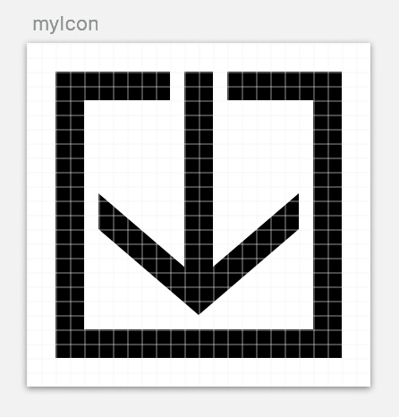
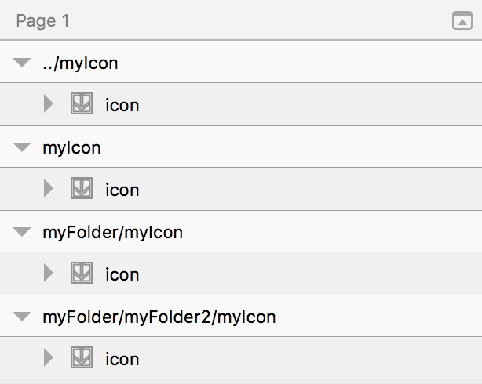
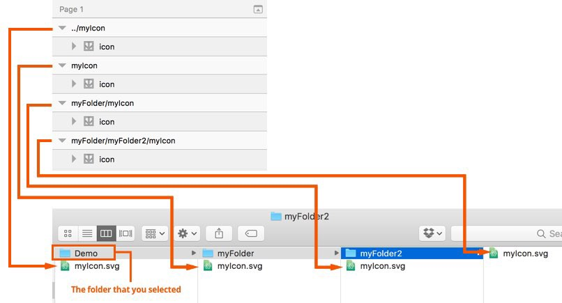
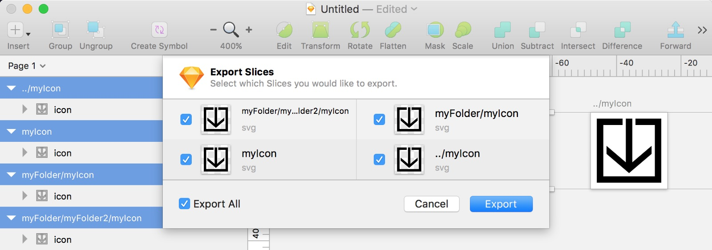
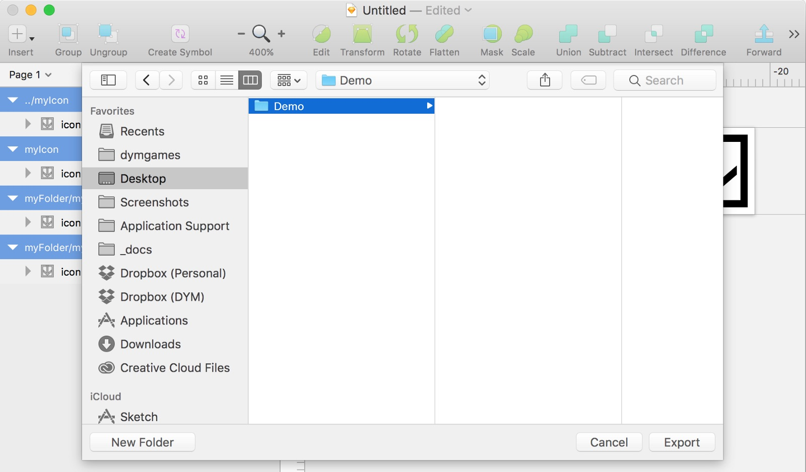
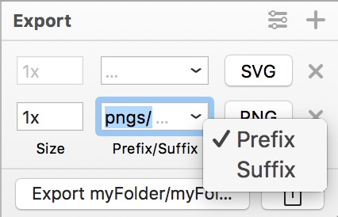

When I was using Photoshop/Illustrator for my asset workflow I had to set up all kinds of tricks to make sure things wound up in the correct folder with the correct file name. You know the drill; The endless process of selecting the right artboards or layers to export, save dialogs, output settings, overwriting files, dragging and dropping to the correct asset folder. Ugh.

Sketch has a few tricks up it’s sleeve that makes this process ridiculously easy and consistent. You can use the _layer name_ to specify a directory that the asset will export to? Yup! It’s hands-down one of my favorite magic tricks of Sketch!

Let’s say that you’ve made this super sweet icon.

You’ve set it up to export an SVG (good job!).

You can use the layer name to specify not only the filename (myIcon), but the _output directory!_

Sketch is ridiculously smart about this too!

- It will automatically overwrite your files by default.
- If the directory doesn’t exist it will create it for you.
- If layer name has several `/` then it will create all of the necessary directories that it needs.
- It even recognizes `../` as a parent directory and will traverse up! You can even do crazy complex traversing: `../../myFolderTwoFoldersBack`.

Check out this configuration:

## How to Export

When it comes to exporting, select the assets you want to export and then use the File > Export (⇧+⌘+E) to export only the selected assets.

Hit Export. Select the path that you’d like to output to:

In my case everything will be exported relative to the “Demo” directory!

## Bonus trick

You can use this same trick _inside the export panel!_ The following will export an SVG in all of those folders (like before), plus create a `pngs` folder and put all of those folders/files in there.

Sketch is ridiculously cool. You can save a ton of time and frustration by setting up your structure _within Sketch_, then let your computer do all of the sorting for you. After-all, isn’t that what computers are for?

Let me know if you have any other cool exporting tricks with Sketch!
