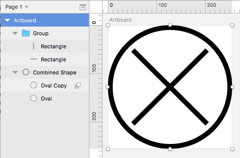

This is a pretty quick tip, but something I don't feel like has gotten much attention.

If you're doing anything for the web it's important to make sure that your images are compressed. You see, when you put any 'ole image out there on the web, people seeing that image have to download it (thus the "internet"). The larger the image, the longer it takes to download. This can be detrimental for users with slower connections. Image compression these days can be done with almost no noticeable loss in quality and fairly quickly.

That said, adding compression to a designer's workflow stinks. It takes you out of the creative process. No one want to get done with a sweet graphic and then turn around do some technical process on the final image. Luckily Sketch has your back! It can compress your images automatically! 
Our wonderful friends at Bohemian Coding have created plugins to compress your images on export. Go right now and download [SVGO][] and [Bitmap compressor][].

---

Okay, now that you have those, let's take a look at how one of these work, specifically SVGO.
When you have the SVGO plugin turned on, all you have to do is export an SVG - Sketch sees that you're exporting an SVG and automatically run it through SGVO.

## What is SVGO?

SVGO is a small, Nodejs-based tool that cleans up SVGs. It's actually an open-source command-line tool written by other people (not Bohemian Coding), but is used by a ton of websites and server applications. Sketch just happens to have a wrapper for it!

## Okay, so what is SVGO actually doing?

Well, SVGs normally output by Sketch are a little fat. They have a lot of extra data included in them to ensure that they are able to be edited later on by Sketch. You don't need this extra data when your putting these images on the web. SVGO opens these SVGs and starts running little scripts to remove unused tags, whitespace, metadata, round vector data, merge groups and shapes. It actually does a pretty good job!

Let's look at an example. Here is a pretty simple icon drawn in Sketch:

When I export this image as an SVG it turns out to be 1,306 bytes on my computer. When I export it with SVGO turned on it's 764 bytes - a little over HALF the size! That's crazy. If your website is using a lot of SVGs this could really speed up your site.

[svgo]: https://www.sketch.com/extensions/plugins/svgo-compressor/ "SVGO "
[bitmap compressor]: https://www.sketch.com/extensions/plugins/bitmap-compressor/ "Bitmap Compressor"
