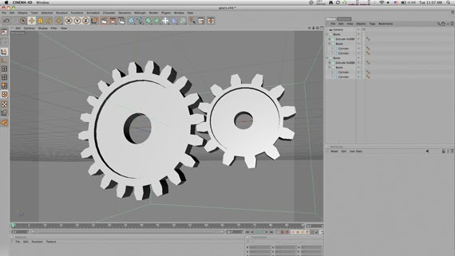

I have this subconscious fear of clicking a checkbox and my computer instantaneously blowing up and me losing my artwork and eyebrows, the latter of which I can grow back. So you can imagine that there are a lot of undiscovered things for me. Which lead me to my next tutorial.

I got a phone call from [Jason][1] trying to make a “blue-print” from some 3d gears in C4d but he doesn’t have the Sketch and Toon Module. We came up with an easy fix using the Cel Renderer plugin that comes with C4D, which you can do some pretty useful things.

First, click Render -> Render Settings (cmd+b).

Then, in the Effects selector, click and select “Cel Renderer”. If you hit render right now, you will get this:

What Cel Render is doing is drawing cels from the outline of your objects (kindof like a silhouette, but not filled in). This may not seem that useful right now, but think of taking this shape into Photoshop or an animation into AE and you can do some pretty cool things with the data we just created. Let’s check out the other setting.

If you click the Edges checkbox you can see that it now not only draws the outlines, but all of the edges that make up the polygons of the piece.

Of course you can change the background color and the edge colors by selecting new colors in their respective color swatches.
By selecting the Color checkbox you can open up another pandora box of possibilities. Color will use the material color as the cel color.

Illumination is whether or not light will effect the shading of the objects. With illumination you get the Quantize checkbox. This allows you to select how many shades of color to use in your piece, giving you a posterized-kind-of effect.

There you go!

[1]: https://churchtechtalk.com
