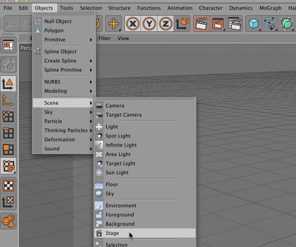
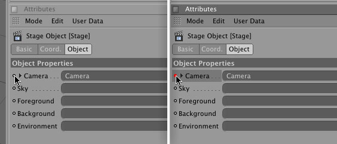

So the other day I discovered a little talked about object in Cinema 4D that I believe deserves more credit. Up until now, my workflow for my 3D animations has been:

1. Create a scene
2. Fly a camera through it
3. Render it
4. Create a new camera/fly through
5. Render it
6. Repeat until desired shots are met
7. Then use Final Cut Pro to edit the renders together.

One time I tried a new system, that kind-of worked; I created a camera, made my moves in order with one-frame camera moves that flew my camera to the next angle. I say kind-of because the extreme moves and bezier splines caused "rubber-banding", where the camera becomes unpredictable. I knew there had to be a better way.

Introducing the Stage object. Accessed through the Object -> Scene menu, the Stage object allows you to drop in multiple cameras, skies, backgrounds, foregrounds and environments, key-framed in at certain times in your timeline. To use insert the stage object into your Object Manager by selecting it in the Object -> Scene menu.

At your first desired camera in-point (probably frame 0) drag your first camera into the "Camera" Field in the Stage Attributes. Create a new keyframe by right-clicking (or Ctrl+clicking on a Mac) on the keyframe icon next to the Camera Attribute (it should turn red).

Go on down your timeline to your next shot and drag the second camera into the Camera Field in the Stage Attribute. Right click (or Ctrl+clicking on a Mac) on the keyframe icon next to the Camera Attribute to create a new keyframe for Camera-Dos!

Repeat for as many shots as desired.

It is important to note that these keyframes work the same as "hold" keyframes in After Effects, not standard keyframes, meaning there will be no "tweening" between the cameras, just a cut.
